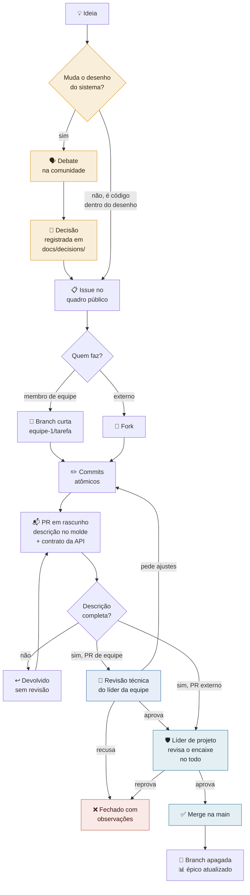

# Como contribuir

Obrigado pelo interesse no OpenClinic! O stack técnico está definido (Node.js no backend, React com Vite no front, PostgreSQL, Docker, monolito modular) e a **fase de código começou**: os primeiros protótipos e o esquema de banco estão em construção. É a melhor hora de chegar: o desenho está fresco, as fundações estão sendo lançadas agora, e quem entra cedo molda o projeto.

## O que mais precisamos agora

**Construir os primeiros incrementos.** A ordem é a das camadas da arquitetura: autenticação e identidade primeiro, depois cadastros, agenda e prontuário. As tarefas vivem nas issues-épico do repositório, e as regras de contribuição de código estão logo abaixo.

**Ajudar a fechar as [decisões ainda em aberto](./docs/decisions/):** a camada de cache e banco de apoio, e o formato dos endpoints da API. Se você tem experiência que ajude a decidir qualquer uma delas, é contribuição de alto impacto.

**Não é preciso programar para contribuir.** Se você é dono ou gestor de clínica, o que você sabe da operação vale tanto quanto código: descrever como um fluxo funciona de verdade, apontar onde a proposta de arquitetura não bate com a rotina, dizer o que está faltando, testar o sistema quando houver ambiente de homologação. Boa parte do desenho registrado em [`modulos.md`](./docs/modulos.md) nasceu exatamente desse tipo de conversa. É o trabalho da frente de uso e validação, descrita no [`GOVERNANCE.md`](./GOVERNANCE.md).

Nesta fase, é especialmente valiosa a experiência em:

- **HL7 FHIR** e interoperabilidade em saúde, em particular sobre a modelagem de *bundles* FHIR sobre banco relacional, o problema técnico central já identificado ([0001](./docs/decisions/0001-fhir-como-padrao-de-dados.md));
- **saúde digital**, com quem já trabalhou com prontuário eletrônico e sabe onde estão as dores reais;
- **segurança da informação**, especialmente em contexto de dados sensíveis.

## Onde a conversa acontece

- O dia a dia do projeto acontece no **grupo de WhatsApp** da comunidade: <https://chat.whatsapp.com/LPxRX9ivXUm6VF4atVKYW7> (o link pode expirar; se não funcionar, abra uma Issue pedindo um novo). É lá que as conversas nascem e que a maior parte das definições é debatida hoje.
- **GitHub Issues** é a porta pública do projeto: quem chega de fora propõe, reporta e pergunta por ali, sem precisar de convite, e tudo fica registrado e pesquisável. É o caminho que tende a ganhar força conforme o projeto crescer.
- **O que vira decisão é registrado em [`docs/decisions/`](./docs/decisions/) e nas atas de [`docs/reunioes/`](./docs/reunioes/).** Conversa, em qualquer canal, não é registro.

## Como participar de uma decisão técnica

1. **Leia o registro da decisão** em [`docs/decisions/`](./docs/decisions/). Ele traz o contexto, os critérios em disputa e as teses já apresentadas, para que você não precise repetir o que já foi dito.
2. **Traga sua posição ao debate**, no grupo de WhatsApp, numa reunião ou numa Issue. Se sua contribuição é uma tese nova, uma Issue do tipo *Proposta de decisão técnica* a deixa pública e pesquisável desde o início.
3. **Assine sua posição.** Argumentos entram no registro permanente com o nome de quem os defende. O projeto não atribui posições a pessoas por conta própria, nem a partir de transcrição de reunião.

Teses vencidas **permanecem no registro**. Discordar e perder não apaga sua contribuição do histórico do projeto: ela fica lá, explicando o que já foi pesado.

## Regra de contribuição

**Nenhuma contribuição, código ou texto, é incorporada ao projeto sem que a pessoa que contribui concorde com os termos de licenciamento vigentes do OpenClinic**, descritos em [`licensing.md`](./docs/licensing.md). Isso vale desde já, mesmo antes de existir um CLA formal.

Quando o projeto entrar em fase de código, um **CLA (Contributor License Agreement)** será exigido de todo contribuidor externo, e o texto desse CLA será publicado para comentário público antes de passar a ser exigido, não imposto de surpresa.

## Como contribuir com código

Os requisitos de engenharia acordados para o backend: conformidade com **SOLID**, desenho orientado ao domínio (**DDD**), **arquitetura limpa** e documentação técnica da API suficiente para viabilizar uma reimplementação independente.

**Quem muda a API entrega o contrato OpenAPI atualizado no mesmo Pull Request.** O código nasce primeiro e o contrato nasce com ele ([0008](./docs/decisions/0008-contrato-antes-ou-depois-do-codigo.md)): endpoint sem contrato não existe, a verificação automática rejeita divergência, e mudança de API passa por revisão explícita antes de virar compromisso com terceiros. Documentar não é etapa posterior. É parte da mudança.

As regras de contribuição, acordadas em [reunião](./docs/reunioes/2026-08-26-fechamento-do-stack.md):

- **Tarefas pequenas.** Uma contribuição deve caber em poucas horas de trabalho, não em dias. Se a tarefa é maior que isso, quebre antes de começar.
- **Commit atômico.** Cada commit tem um objetivo e uma razão, e a mensagem explica o porquê. IA pode ajudar a redigir; a revisão final e a responsabilidade são de quem assina.
- **Pull request que se explica.** Descreva o que fez e como testou. O revisor pode devolver uma mudança confusa pedindo que ela volte explicada, e pode exigir teste automatizado junto.
- **IA é ferramenta, não substituta.** Use à vontade para escrever código, desde que você entenda e responda pelo que está submetendo. Mudança espalhada em muitos lugares ao mesmo tempo, sem razão clara por commit, não entra.
- **Cada módulo tem um validador**: o líder do time responsável por ele, que aprova todo pull request que o toca (veja o [`GOVERNANCE.md`](./GOVERNANCE.md)).

## O fluxo de uma contribuição

**Quem é de uma Equipe de Desenvolvimento** (os times numerados do [`GOVERNANCE.md`](./GOVERNANCE.md)): pegue uma issue designada ao seu time, crie uma branch curta a partir da `main` com o prefixo do time (por exemplo, `equipe-1/login-por-email`), trabalhe e abra o Pull Request para a `main`. O líder do seu time aprova o que toca os módulos do time; um líder de projeto faz o merge. A branch é curta de propósito: nasce de uma tarefa de poucas horas e morre no merge.

**Quem chega de fora** (ainda sem equipe): faça um *fork* (a sua cópia do repositório, no seu perfil), trabalhe nele e abra o Pull Request do fork para a `main` daqui. Um líder de projeto revisa. Esse é o caminho natural para entrar numa equipe: contribuição externa bem feita é como os times recrutam.

O caminho completo, no desenho:

### Os portões, um a um

| # | Portão | Quem segura a chave | O que é checado |
| :--- | :--- | :--- | :--- |
| 1 | **Decisão antes de código** | Conselho fundador | Mudança de arquitetura, escopo ou stack não entra por PR direto: nasce como registro em [`docs/decisions/`](./docs/decisions/) |
| 2 | **Descrição completa** | Quem revisa | O que muda (arquivo por arquivo), por quê, como testou. Sem isso, devolvido sem revisão de código |
| 3 | **Revisão técnica** | Líder da Equipe responsável (PR externo: um líder de projeto) | Correção, padrão de código, encaixe no módulo. É a aprovação obrigatória (CODEOWNERS), e termina de um de três jeitos: aprova, pede ajustes ou recusa com observações. É esse filtro que poupa o líder de projeto |
| 4 | **Revisão de integração** | Líder de projeto | Só chegam aqui PRs já aprovados pelo líder da equipe, ou vindos de colaborador externo. Contrato da API atualizado no mesmo PR, efeito nos módulos vizinhos, superfície de segurança |
| 5 | **O merge em si** | Líder de projeto | Só quem está nesse grupo consegue completar o merge na main, por regra do repositório |

### O que cada papel pode fazer

| Ação | Externo | Membro de Equipe | Líder de Equipe | Líder de projeto |
| :--- | :---: | :---: | :---: | :---: |
| Abrir Issue e discutir | ✅ | ✅ | ✅ | ✅ |
| Abrir pull request | ✅ (via fork) | ✅ | ✅ | ✅ |
| Criar branch no repositório | ❌ | ✅ | ✅ | ✅ |
| Aprovação que conta para o merge | ❌ | ❌ | ✅ (nos módulos do seu time) | ✅ |
| Completar o merge na main | ❌ | ❌ | ❌ | ✅ |

### Pull request de colaborador externo

Revisar contribuição de quem ainda não conhecemos custa caro, então a regra é dura de propósito: **pull request externo sem descrição completa é devolvido sem revisão de código**. O modelo do repositório já traz os campos; o padrão esperado é este, preenchido:

> **O que muda**
> Adiciona validação de dígito verificador ao campo CPF do cadastro de paciente.
>
> - `backend/src/modules/people/validators/cpf.js`: função nova `isValidCpf`, com o algoritmo dos dois dígitos verificadores e rejeição de sequências repetidas.
> - `backend/src/modules/people/patient.service.js`: criação e edição de paciente passam a chamar a validação e devolvem o erro `INVALID_CPF`.
> - `backend/test/people/cpf.spec.js`: doze casos de teste, entre CPFs válidos, dígitos errados e sequências repetidas.
>
> **Por quê**
> O requisito `ECF.17.16` da matriz de conformidade exige validação de dígito verificador, e a issue #NN pede exatamente isso. Sem a validação, um erro de digitação da recepção cria um cadastro que a busca por CPF nunca mais encontra.
>
> **Como testei**
> `npm test` no módulo, com os doze casos passando. Subi o sistema com `docker compose up` e testei pela interface: CPF inválido é recusado com a mensagem certa, CPF válido segue o fluxo normal.

Uma mudança por pull request: se você mexeu em duas coisas sem relação, são dois pull requests. E cada commit segue as regras da seção anterior, atômico e com a razão escrita.

### Quero entrar numa equipe

As **guildas** (Frontend, Backend, Banco de dados, Segurança) são o catálogo de habilidades da comunidade: não têm poder nenhum, e servem para os líderes saberem quem é bom em quê na hora de montar e reforçar os times. Para entrar numa guilda ou se candidatar a um time, abra uma [Issue](../../issues) se apresentando: o que você sabe fazer, quanto tempo tem por semana, e em que parte do projeto quer mexer.

A documentação do projeto é escrita em **português**. Código, identificadores, mensagens de commit e a especificação da API são escritos em **inglês**.

## Código de conduta

Toda interação no projeto, seja no grupo de WhatsApp, em Issues e Pull Requests ou nas reuniões, segue o [`CODE_OF_CONDUCT.md`](./CODE_OF_CONDUCT.md).
