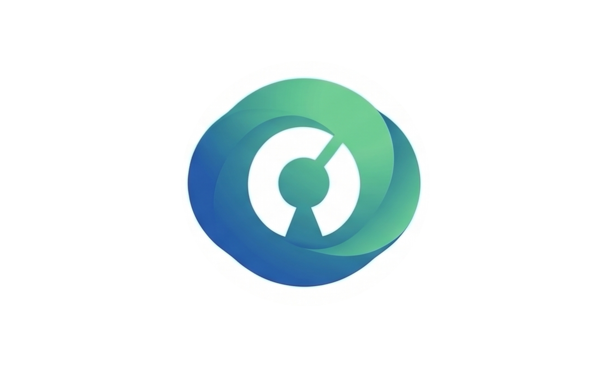

# OpenClinic

**Prontuário eletrônico médico open source, com API aberta desde a concepção.**

Um contraponto aos prontuários de mercado que fecham seu ecossistema e não liberam suas APIs.

 

> [!WARNING]
> **Ainda não existe software.** Este repositório contém, por enquanto, apenas a visão, os princípios e a estrutura de fundação do projeto. Nada aqui pode ser usado em atendimento a pacientes.

 

## Por que este projeto existe

Prontuários eletrônicos comerciais, em geral, fecham seus dados. Sair de um fornecedor ou integrar outro sistema costuma ser difícil, caro ou simplesmente impossível.

O OpenClinic nasce para ser diferente: um prontuário cujo código é aberto e cuja API é, desde o primeiro dia, tratada como um produto tão importante quanto a própria interface.

 

## Os pilares

### 🔓 API aberta e pública
Robusta e bem documentada desde a concepção, com [HL7 FHIR](https://www.hl7.org/fhir/) como padrão de referência pretendido.

### 🔐 Segurança e conformidade desde o desenho
Dado de saúde é dado sensível. O projeto assume isso desde a fundação, não como um remendo posterior. Veja o mapeamento regulatório em [`COMPLIANCE.md`](./COMPLIANCE.md).

### 🤝 Comunidade aberta
Construído com quem quiser participar, não atrás de portas fechadas.

Detalhes completos em [`vision.md`](./vision.md).

 

## Documentação

| Documento | O que contém |
| :--- | :--- |
| [`vision.md`](./vision.md) | Missão, problema, princípios e escopo do projeto |
| [`prd.md`](./prd.md) | Requisitos de produto conceituais, pré-técnicos |
| [`COMPLIANCE.md`](./COMPLIANCE.md) | Normas brasileiras relevantes (LGPD, ANVISA, SBIS, RNDS, TISS e outras) |
| [`LICENSING.md`](./LICENSING.md) | Como o projeto é licenciado e por quê |
| [`GOVERNANCE.md`](./GOVERNANCE.md) | Como o projeto é decidido hoje, e como isso deve evoluir |
| [`CONTRIBUTING.md`](./CONTRIBUTING.md) | Como participar |
| [`ROADMAP.md`](./ROADMAP.md) | As fases planejadas do projeto |
| [`CODE_OF_CONDUCT.md`](./CODE_OF_CONDUCT.md) | Regras de convivência da comunidade |
| [`SECURITY.md`](./SECURITY.md) | Como reportar uma vulnerabilidade |

 

## Como participar

O projeto está numa fase inicial, sem código ainda. O mais valioso agora é discussão sobre a visão e o produto.

**Abra uma [Issue](../../issues).** É o canal oficial e pesquisável do projeto.

**Entre no [grupo de WhatsApp da comunidade](https://chat.whatsapp.com/LPxRX9ivXUm6VF4atVKYW7).** Se o link estiver expirado, avise por uma Issue.

Veja o guia completo em [`CONTRIBUTING.md`](./CONTRIBUTING.md).

 

## Licença

Este repositório, código e conteúdo, é distribuído sob a **[GNU Affero General Public License v3.0](./LICENSE)**.

Qualquer pessoa pode usar, modificar e hospedar o OpenClinic, inclusive comercialmente, desde que mantenha as modificações abertas sob a mesma licença. O projeto também prevê uma licença comercial alternativa para quem não puder cumprir essa condição. Detalhes em [`LICENSING.md`](./LICENSING.md).

Copyright © 2026 Dr. Daniel Dorta Santiago de Carvalho Duarte, CRM 174209, e colaboradores do OpenClinic.

 

## Idioma

Este repositório é escrito em português. Tradução para inglês e espanhol está nos planos, conforme o projeto e sua comunidade crescerem.

 
Iniciativa OpenClinic

