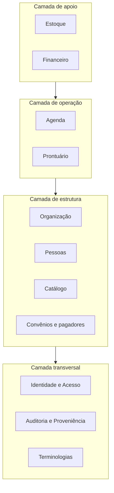
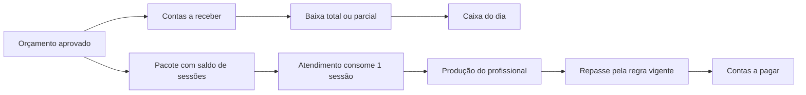

# Arquitetura de módulos da V1

> [!IMPORTANT]
> **Este documento é uma proposta, não uma decisão.** Ele traduz os requisitos de produto ([`prd.md`](./prd.md)) em módulos, entidades e regras de negócio, para revisão da comunidade técnica. Discordâncias e lacunas devem virar Issue ou Pull Request. O que a revisão confirmar passa a orientar o desenho do esquema de banco e da API.

## Como ler este documento

Todo módulo segue o mesmo roteiro: **Responsabilidade → Entidades → Regras de negócio → O que fica fora → Mapeamento FHIR → Dependências**. Os campos de cada cadastro não estão aqui — estão no dicionário de dados, [`cadastros.md`](./cadastros.md). O que está decidido é afirmado no indicativo; o que segue em aberto está reunido na seção [Questões abertas](#questões-abertas), e apenas lá.

As tags no formato [`SBIS ECF.03.02`](./conformidade-sbis.md) apontam requisitos da certificação SBIS v5.2 atendidos por aquela linha. A matriz completa, com a paráfrase de cada requisito, está em [`conformidade-sbis.md`](./conformidade-sbis.md). Nos blocos **Mapeamento FHIR**, cada nome de recurso é um link para a sua página na especificação oficial — a R4, que é uma versão congelada.

### Glossário

| Termo | Significado |
| :--- | :--- |
| **Atendimento (Encounter)** | O evento em que um paciente é atendido. É a espinha do prontuário: todo documento clínico nasce vinculado a um Atendimento. |
| **Recurso agendável** | Tudo que possui horários e pode ser reservado — profissional ou sala. Um único mecanismo de disponibilidade e conflito serve aos dois. |
| **Fonte pagadora** | Quem paga um atendimento: o próprio paciente (pagador "Particular") ou um plano de convênio. Orçamento, agendamento e atendimento sempre carregam uma fonte pagadora. |
| **Soft delete** | Exclusão que marca o registro como excluído em vez de removê-lo. É o único tipo de exclusão que existe no sistema. |
| **Terminologia** | Tabela de códigos oficiais (TUSS, CID-10, CBO…) tratada como **dado**, com versão e vigência — nunca fixada em código-fonte. |
| **Vigência** | Período em que um valor vale (datas de início e fim). Preços, códigos, repasses e horários têm vigência: mudar um valor cria um período novo, sem apagar a história. |
| **Pacote** | Venda de um conjunto de sessões de um procedimento. O pacote tem saldo; cada atendimento realizado consome uma sessão. |
| **E1 / E2 / E3** | Estágios de maturidade da certificação SBIS. A V1 mira o Estágio 1 completo mais a certificação de segurança NGS2 — ver [`conformidade-sbis.md`](./conformidade-sbis.md). |

## A visão em camadas

Cada camada só depende das camadas abaixo dela. Os módulos transversais não dependem de ninguém — todos os outros dependem deles.

| Camada | Módulo | Responsabilidade em uma linha |
| :--- | :--- | :--- |
| Transversal | [Identidade e Acesso](#identidade-e-acesso) | Quem entra, o que cada perfil pode fazer, e as credenciais de integração |
| Transversal | [Auditoria e Proveniência](#auditoria-e-proveniência) | Trilha imutável de quem fez o quê, e a origem permanente de cada dado |
| Transversal | [Terminologias](#terminologias) | Todos os códigos oficiais como dado versionado, nunca como código-fonte |
| Estrutura | [Organização](#organização) | A clínica como entidade jurídica e física: unidades e salas |
| Estrutura | [Pessoas](#pessoas) | Paciente, profissional de saúde e funcionário — três cadastros distintos |
| Estrutura | [Catálogo](#catálogo) | O que a clínica oferece: procedimentos e suas regras |
| Estrutura | [Convênios e pagadores](#convênios-e-pagadores) | Quem paga: operadoras, planos, vínculos e tabelas de preços |
| Operação | [Agenda](#agenda) | O coração operacional: horários, conflitos e o ciclo de cada agendamento |
| Operação | [Prontuário](#prontuário) | O registro clínico, com o Atendimento como espinha |
| Apoio | [Estoque](#estoque) | Produtos, kits e movimentação por unidade |
| Apoio | [Financeiro](#financeiro) | Do orçamento ao caixa, incluindo o repasse dos profissionais |

## Princípios que valem em todos os módulos

1. **Nada some.** Toda entidade tem soft delete, auditoria e proveniência. Exclusão marca; correção versiona; a história permanece consultável.
2. **Nenhum dado clínico na camada administrativa.** Ficha de cadastro não é prontuário. Alergias, diagnósticos e medicações vivem no módulo Prontuário e são visíveis apenas a perfil clínico [`SBIS NGS1.03.06`](./conformidade-sbis.md); a trilha de auditoria também não carrega conteúdo clínico nem identificação de paciente [`SBIS NGS1.07.06`](./conformidade-sbis.md). Conceder acesso clínico a outro perfil é decisão explícita e auditada da clínica, nunca comportamento padrão.
3. **Catálogo não é realizado.** O procedimento do Catálogo é a definição; o procedimento realizado é um fato do Atendimento — é ele que consome kit, consome sessão de pacote e gera produção para repasse.
4. **Paciente é da organização; operação é da unidade.** O cadastro do paciente é um só, compartilhado entre as unidades. Agenda, estoque e caixa existem por unidade.
5. **Código, nunca texto livre.** Onde existe terminologia oficial, o campo referencia o módulo Terminologias. Texto livre é para observação humana, não para dado que precisa ser comparável.
6. **Dados de organizações distintas nunca se misturam** [`SBIS NGS1.06.04`](./conformidade-sbis.md). Isolamento entre clínicas é requisito próprio, separado do controle de acesso.

**Obrigações de plataforma** (valem para qualquer implementação): cópia de segurança cifrada, com restauração e verificação de integridade pela própria aplicação ou pelo banco [`SBIS NGS1.04.01`](./conformidade-sbis.md); comunicação cifrada entre cliente e servidor [`SBIS NGS1.05.01`](./conformidade-sbis.md), com validação de toda entrada no lado do servidor [`SBIS NGS1.06.03`](./conformidade-sbis.md); anexos armazenados fora do banco somente com sigilo garantido e nomes de arquivo que não revelam conteúdo [`SBIS NGS1.06.01`](./conformidade-sbis.md); data e hora com fuso horário parametrizável [`SBIS NGS1.09.06`](./conformidade-sbis.md); interface de usuário 100% em português do Brasil [`SBIS ECF.17.18`](./conformidade-sbis.md) — código, identificadores e API continuam em inglês, conforme o [`README`](../README.md).

---

## Camada transversal

### Identidade e Acesso

**Responsabilidade.** Autenticar quem usa o sistema, definir o que cada perfil pode fazer e guardar as credenciais das integrações — nas duas direções: quem acessa o OpenClinic e o que o OpenClinic acessa fora.

**Entidades.**

- **Usuário** — a conta de acesso de um profissional ou funcionário.
- **Papel e permissões** — permissões granulares por domínio (clínico, administrativo, financeiro, gestão), agrupadas em papéis.
- **Chave de API** — credencial de uma ferramenta externa que acessa o OpenClinic.
- **Segredo** — credencial que o OpenClinic usa para acessar um serviço externo, guardada no cofre de segredos.
- **Termo de uso** — versão vigente dos termos e o aceite de cada usuário.

**Regras de negócio.**

- O CPF é o identificador único de usuário, e um usuário que já operou o sistema jamais é removido [`SBIS NGS1.03.09`](./conformidade-sbis.md).
- Senha com no mínimo 8 caracteres, contendo letras e números [`SBIS NGS1.02.03`](./conformidade-sbis.md), armazenada como hash com SALT [`SBIS NGS1.02.02`](./conformidade-sbis.md), troca obrigatória no primeiro acesso [`SBIS NGS1.02.06`](./conformidade-sbis.md), bloqueio após no máximo 10 tentativas [`SBIS NGS1.02.13`](./conformidade-sbis.md), bloqueio de sessão por inatividade [`SBIS NGS1.02.20`](./conformidade-sbis.md), recuperação de senha pelo canal registrado no cadastro [`SBIS NGS1.02.12`](./conformidade-sbis.md) e mensagem de erro de login que não revela qual dado está errado [`SBIS NGS1.02.16`](./conformidade-sbis.md).
- Três perfis existem desde a instalação: administrador do sistema, perfil administrativo **sem acesso a dado clínico** e profissional de saúde. Os demais papéis são compostos por permissão [`SBIS NGS1.03.03`](./conformidade-sbis.md).
- O termo de uso e privacidade é aceito no primeiro acesso e novamente a cada mudança de conteúdo [`SBIS NGS1.11.01`](./conformidade-sbis.md).
- **Chaves de API** (tela Configurações → Integrações): cada integração tem nome, descrição de uso e **escopo mínimo** — só os domínios e operações de que precisa. O token é gerado pelo sistema, exibido uma única vez e guardado como hash, irrecuperável. Revogação é imediata e mantém o histórico. Cada integração tem identificação única na trilha de auditoria.
- **Cofre de segredos**: cifrado em repouso, acessível só a perfil de gestão, nunca legível de volta pela API, com uso auditado. O certificado A1 e sua senha, quando usados, ficam neste cofre. Na V1 o único consumidor é o provedor de assinatura digital.

**O que fica fora.** Login social ou federado; provisionamento automático de usuários.

**Mapeamento FHIR.** Usuário não é recurso FHIR — a identidade clínica correspondente é o [`Practitioner`](https://hl7.org/fhir/R4/practitioner.html) (módulo Pessoas). Acessos e ações geram [`AuditEvent`](https://hl7.org/fhir/R4/auditevent.html) (módulo Auditoria e Proveniência).

**Dependências.** Auditoria e Proveniência.

### Auditoria e Proveniência

**Responsabilidade.** Registrar, em trilha imutável, quem fez o quê e quando; e carregar em cada dado a sua origem — quem o registrou e de onde veio — como parte do modelo, não como log de aplicação.

**Entidades.**

- **Evento de auditoria** — ação registrada: login, leitura, criação, alteração, exclusão lógica, impressão, exportação, assinatura, uso de chave de API ou do cofre [`SBIS NGS1.07.03`](./conformidade-sbis.md).
- **Proveniência** — em cada registro do sistema: autor, data/hora, origem (digitação, importação, API — e qual integração).

**Regras de negócio.**

- A trilha não pode ser editada nem removida, por ninguém — nem pelo administrador.
- A trilha **não contém dado clínico nem identificação de paciente**: referencia registros por identificador opaco [`SBIS NGS1.07.06`](./conformidade-sbis.md).
- Existe interface de consulta da trilha com filtros por período, usuário e tipo de evento, restrita a perfil autorizado [`SBIS NGS1.07.07`](./conformidade-sbis.md).
- O soft delete é implementado aqui como comportamento herdado por todas as entidades do sistema.

**O que fica fora.** Anonimização e pseudonimização de bases (estágios posteriores da certificação).

**Mapeamento FHIR.** [`AuditEvent`](https://hl7.org/fhir/R4/auditevent.html) (trilha) e [`Provenance`](https://hl7.org/fhir/R4/provenance.html) (proveniência).

**Dependências.** Nenhuma. Todos os módulos dependem deste.

### Terminologias

**Responsabilidade.** Manter todos os códigos oficiais como dado em banco — com sistema de origem, versão, idioma, termo original e vigência — e fornecer o mecanismo de importação. Nenhuma tabela oficial vive em código-fonte [`SBIS ECF.17.12`](./conformidade-sbis.md).

**Entidades.**

- **Sistema de codificação** — a fonte: TUSS tabela 22, CID-10, CBO…
- **Código** — um item de um sistema, gravado com sistema, versão, idioma, código e termo original [`SBIS ECF.17.10`](./conformidade-sbis.md), mais vigência.
- **Princípio ativo** — a Denominação Comum Brasileira (DCB), importada como base da referência clínica de medicamentos [`SBIS ECF.04.01`](./conformidade-sbis.md).
- **Medicamento** — referência clínica gerenciável pela clínica: princípios ativos, classe, forma farmacêutica, concentração, vias de administração e marcação de controle especial (Portaria 344) [`SBIS ECF.04.02`](./conformidade-sbis.md). **Não confundir com Produto do Estoque**: Medicamento é o que se prescreve; Produto é o que se compra e consome.

**Regras de negócio.**

- Três famílias de terminologia entram na V1 com **seed inicial + importador re-executável** (rodar de novo atualiza a versão sem apagar a anterior):
  - **Faturamento:** TUSS tabela 22 (procedimentos), TUSS tabelas 19 e 20 (materiais e medicamentos) e operadoras registradas na ANS.
  - **Clínica:** CID-10, CIAP-2 [`SBIS ECF.07.14`](./conformidade-sbis.md) e DCB.
  - **Administrativa:** CBO, conselhos profissionais e as tabelas de domínio do Ministério da Saúde usadas nos cadastros (sexo, raça/cor, estado civil…).
- O mecanismo suporta as ~60 tabelas de guia TISS, mas elas **não entram na V1** — entram quando o faturamento de convênio entrar.
- **Brasíndice e SIMPRO:** o campo de código existe no Produto, mas o dado é licenciado e **jamais é distribuído** com o OpenClinic. Cada clínica que possuir licença importa o seu.
- SIGTAP (tabela do SUS) está fora do escopo.

**O que fica fora.** Tabelas de guia TISS (V1); SIGTAP; distribuição de dados licenciados.

**Mapeamento FHIR.** Sistema e Código correspondem a [`CodeSystem`](https://hl7.org/fhir/R4/codesystem.html)/[`ValueSet`](https://hl7.org/fhir/R4/valueset.html); nos registros, todo código viaja como [`CodeableConcept`](https://hl7.org/fhir/R4/datatypes.html#CodeableConcept) (sistema + código + versão + texto).

**Dependências.** Nenhuma.

---

## Camada de estrutura

### Organização

**Responsabilidade.** Representar a clínica como entidade jurídica e física: a organização, suas unidades de atendimento e as salas de cada unidade.

**Entidades.**

- **Organização** — a instalação do sistema; a fronteira absoluta de isolamento de dados.
- **Unidade de atendimento** — endereço físico com CNPJ e CNES próprios, tipo de estabelecimento e **responsável técnico** [`SBIS ECF.01.01`](./conformidade-sbis.md), identidade documental (logo, cabeçalho e rodapé de receitas, atestados e orçamentos), horários de funcionamento, feriados e **fuso horário** [`SBIS NGS1.09.06`](./conformidade-sbis.md).
- **Sala** — espaço agendável ou não, com os equipamentos que oferece.

**Regras de negócio.**

- Multiunidade desde a V1. Toda operação (agenda, estoque, caixa) referencia uma unidade.
- CNES e CNPJ têm dígito verificador validado e bloqueiam cadastro duplicado de unidade [`SBIS ECF.17.16`](./conformidade-sbis.md).
- Sala marcada como agendável vira um **recurso agendável** — a mecânica de disponibilidade e conflito é do módulo Agenda.
- Os equipamentos da sala explicam a compatibilidade entre salas e procedimentos declarada no Catálogo.

**O que fica fora.** Gestão predial e de manutenção de equipamentos.

**Mapeamento FHIR.** [`Organization`](https://hl7.org/fhir/R4/organization.html) (organização e unidade), [`Location`](https://hl7.org/fhir/R4/location.html) (unidade física e sala).

**Dependências.** Terminologias, Pessoas (responsável técnico).

### Pessoas

**Responsabilidade.** Os três cadastros de pessoas — paciente, profissional de saúde e funcionário — e as regras que os distinguem.

**Entidades.**

- **Paciente** — pertence à organização e é compartilhado entre unidades. Campos em [`cadastros.md`](./cadastros.md#paciente).
- **Profissional de saúde** — quem exerce ato profissional: tem conselho de classe e **tem agenda**. Campos em [`cadastros.md`](./cadastros.md#profissional-de-saúde).
- **Funcionário** — quem opera o sistema sem exercer ato profissional: **não tem conselho nem agenda**. Campos em [`cadastros.md`](./cadastros.md#funcionário).
- **Vínculo profissional–unidade** — em quais unidades o profissional atende e com quais procedimentos habilitados. A disponibilidade de horários pertence à Agenda.

**Regras de negócio.**

- **Paciente:**
  - Recebe **número de prontuário automático e imutável** ao ser cadastrado [`SBIS ECF.03.02`](./conformidade-sbis.md).
  - É localizável por nome, nome social, número de prontuário, CPF e nome da mãe [`SBIS ECF.03.11`](./conformidade-sbis.md).
  - CPF, quando informado, é único — o sistema bloqueia duplicidade [`SBIS ECF.03.07`](./conformidade-sbis.md) e valida o dígito verificador de CPF e CNS [`SBIS ECF.17.16`](./conformidade-sbis.md).
  - A ficha de cadastro é **exclusivamente administrativa** — ver princípio 2. O que a recepção vê e edita não contém nenhum dado clínico.
  - Vínculos entre pacientes são tipados (cônjuge, filho(a), pai/mãe, outro) e podem marcar responsabilidade legal; responsável que não é paciente entra com nome, CPF e parentesco, sem virar cadastro completo.
  - Origem do paciente e "indicado por" são registráveis. Registrar a origem é lícito e útil à gestão; **premiar indicação é captação de clientela, vedada pela ética médica** — o sistema registra, não premia.
  - Etiquetas administrativas (nome + cor) têm **modelo de dados na V1 e funcionalidade fora da V1**. Criação de etiquetas é permissão de gestão; aplicação é da recepção; **condição clínica jamais vira etiqueta** — diagnóstico pertence ao Prontuário, sob acesso clínico.
- **Profissional:**
  - Anti-duplicidade por CPF e por conselho + número + UF; alinhado ao paciente em nome social, sexo, nacionalidade e documento de estrangeiro [`SBIS ECF.02.01`](./conformidade-sbis.md).
  - **A ficha do profissional é um hub de abas**: Dados | Horários de atendimento | Repasse | Permissões. Quem configura resolve tudo num lugar só; por trás, cada aba edita a entidade do módulo dono (Pessoas, Agenda, Financeiro, Identidade e Acesso). Funciona como um aplicativo de banco: a tela "cartão" mostra limite, fatura e seguro juntos, ainda que cada um pertença a um sistema diferente — o usuário não precisa saber disso.
  - Método de assinatura digital por profissional: certificado em nuvem (PSC) ou arquivo A1 — as regras de uso estão no Prontuário.
- **Funcionário:** datas de contratação e desligamento registram a situação do vínculo — desligar não exclui nada. Matrícula eSocial e NIS entram como identificadores externos, sem campo dedicado: folha de pagamento está fora do produto.
- Todos os três cadastros aceitam **identificadores externos** (pares sistema + identificador), expostos pela API para integração bidirecional.

**O que fica fora.** Portal do paciente; folha de pagamento e obrigações de RH (eSocial).

**Mapeamento FHIR.** [`Patient`](https://hl7.org/fhir/R4/patient.html), [`Practitioner`](https://hl7.org/fhir/R4/practitioner.html) + [`PractitionerRole`](https://hl7.org/fhir/R4/practitionerrole.html) (vínculo por unidade), [`RelatedPerson`](https://hl7.org/fhir/R4/relatedperson.html) (vínculos e responsável legal). Identificadores externos são [`identifier`](https://hl7.org/fhir/R4/datatypes.html#Identifier) com `system` próprio; origem e indicação são extensões do projeto.

**Dependências.** Terminologias, Organização, Identidade e Acesso (conta de usuário).

### Catálogo

**Responsabilidade.** Definir o que a clínica oferece: cada procedimento, suas regras de execução e seus vínculos com profissionais, salas, kits e preparo.

**Entidades.**

- **Procedimento** — a definição: nome, categoria, código TUSS 22 opcional, duração padrão, profissionais habilitados, salas compatíveis (e se exige alocação de sala), kits de consumo, modelo de TCLE, instruções de preparo, retorno previsto e intervalo mínimo entre sessões. Campos em [`cadastros.md`](./cadastros.md#procedimento).
- **Modelo de TCLE** — termo de consentimento vinculável a procedimento.

**Regras de negócio.**

- Procedimento é definição; execução é fato do Atendimento (princípio 3).
- O preço não mora aqui: mora na tabela de preços do pagador (módulo Convênios e pagadores). A tela do procedimento exibe os preços em modo de consulta.
- As **instruções de preparo** (jejum e afins) são expostas pela API — é o dado que um parceiro de confirmação de agendamento envia ao paciente.
- O **intervalo mínimo entre sessões** orienta o agendamento de pacotes.
- A tela do procedimento também exibe, em modo de consulta, **quem recebe quanto** de repasse por ele — a edição de repasse vive no Financeiro.

**O que fica fora.** Preço (Convênios e pagadores); execução (Prontuário); consumo de materiais (Estoque, via kit).

**Mapeamento FHIR.** [`HealthcareService`](https://hl7.org/fhir/R4/healthcareservice.html) / [`ActivityDefinition`](https://hl7.org/fhir/R4/activitydefinition.html).

**Dependências.** Terminologias, Organização (salas), Pessoas (profissionais), Estoque (kits).

### Convênios e pagadores

**Responsabilidade.** Estruturar quem paga: operadoras, planos, o vínculo do paciente com o plano e as tabelas de preços. É a fundação completa da fonte pagadora — ainda que a V1 só fature Particular.

**Entidades.**

- **Operadora** — nome, registro ANS, CNPJ, contatos.
- **Plano** — produto da operadora, com registro ANS do produto.
- **Vínculo paciente–plano** — número de carteirinha e validade (vive no cadastro do paciente).
- **Tabela de preços** — preços por pagador, com vigência; opcionalmente por unidade.
- **Particular** — pagador padrão do sistema, existente em toda instalação.

**Regras de negócio.**

- Orçamento, agendamento e atendimento carregam fonte pagadora **desde a V1** — na V1, sempre Particular.
- Faturamento de convênio (TISS) fica fora da V1 por decisão de escopo; quando entrar, encontra a fundação pronta: pagador em todo registro, planos cadastrados, carteirinhas vinculadas e o mecanismo de Terminologias capaz de importar as tabelas de guia.

**O que fica fora.** Faturamento TISS: geração de guias, lotes, glosas.

**Mapeamento FHIR.** [`Organization`](https://hl7.org/fhir/R4/organization.html) (operadora), [`InsurancePlan`](https://hl7.org/fhir/R4/insuranceplan.html) (plano), [`Coverage`](https://hl7.org/fhir/R4/coverage.html) (vínculo paciente–plano).

**Dependências.** Terminologias (operadoras ANS), Pessoas.

---

## Camada de operação

### Agenda

**Responsabilidade.** O coração operacional da clínica: disponibilidade de profissionais e salas, marcação, encaixe, bloqueios e o ciclo de vida de cada agendamento — com a usabilidade como requisito de primeira ordem, conforme o [`prd.md`](./prd.md).

**Entidades.**

- **Recurso agendável** — a face agendável de um profissional (por unidade) ou de uma sala.
- **Disponibilidade** — janelas padrão de atendimento do recurso (dias, horários, duração de slot), **com vigência**: mudar o horário de um profissional cria um período novo e preserva a história.
- **Bloqueio** — período indisponível, com motivo e recorrência opcional.
- **Agendamento** — paciente + procedimento + profissional + unidade + data/hora (+ sala, quando o procedimento exige), com status, pagador e canal de origem. Campos em [`cadastros.md`](./cadastros.md#agendamento).

**Regras de negócio.**

- Ciclo de status: **agendado → confirmado → chegou/aguardando → em atendimento → finalizado**, com desvios **faltou** e **cancelado**. O painel de espera do dia é uma visão por status, não outra estrutura.
- **Encaixe** existe como marcação explícita: agendamento fora das janelas de disponibilidade, permitido e visível como tal.
- Conflitos são checados nos dois recursos: um profissional não está em dois lugares, uma sala não recebe dois procedimentos.
- Procedimento que exige sala só é agendado com sala alocada.
- Cada agendamento registra o **canal de origem** (recepção, telefone, integração via API) — é a métrica de quanto cada canal e cada parceiro geram.
- **Confirmação de agendamento fica fora do núcleo, de propósito**: lembretes e confirmação por mensagem são o primeiro caso de uso real da API e dos webhooks descritos no [`prd.md`](./prd.md). Parceiros constroem; o núcleo expõe agendamentos, instruções de preparo e recebe a mudança de status.

**O que fica fora.** Envio de lembretes e confirmação (parceiros, via API); lista de espera; telemedicina.

**Mapeamento FHIR.** [`Schedule`](https://hl7.org/fhir/R4/schedule.html) (disponibilidade do recurso), [`Slot`](https://hl7.org/fhir/R4/slot.html) (janelas), [`Appointment`](https://hl7.org/fhir/R4/appointment.html) (agendamento — o ciclo de status mapeia 1:1 para [`Appointment.status`](https://hl7.org/fhir/R4/appointment-definitions.html#Appointment.status)).

**Dependências.** Pessoas, Organização, Catálogo, Convênios e pagadores.

### Prontuário

**Responsabilidade.** O registro clínico do paciente: o Atendimento como espinha, os documentos clínicos que nascem dele, o resumo clínico estruturado e a assinatura digital que dá validade jurídica a tudo.

**Entidades.**

- **Atendimento (Encounter)** — vincula paciente, profissional, unidade, agendamento de origem e fonte pagadora; agrega todos os registros feitos naquele evento.
- **Documentos clínicos** — anamnese (estruturada no modelo SOAP [`SBIS ECF.07.13`](./conformidade-sbis.md)), evolução clínica, receita comum e **de controle especial**, solicitação de exames, encaminhamento, atestado e outros documentos.
- **Modelos por especialidade** — templates de documentos, geridos pela clínica.
- **Anexos** — arquivos vinculados ao atendimento ou ao paciente [`SBIS ECF.07.38`](./conformidade-sbis.md).
- **Consentimentos** — TCLE emitido a partir do modelo do Catálogo e consentimentos do paciente sobre o uso dos seus dados, com status (autorizado, não autorizado, revogado) e anexo do termo assinado [`SBIS NGS1.11.05`](./conformidade-sbis.md).
- **Resumo clínico** — listas estruturadas do paciente, mantidas a partir dos atendimentos: **alergias** (com o registro explícito "nega alergias") [`SBIS ECF.07.05`](./conformidade-sbis.md), **diagnósticos** [`SBIS ECF.07.15`](./conformidade-sbis.md) e **medicações em uso** [`SBIS ECF.07.52`](./conformidade-sbis.md) — esta última é **derivada**: coletada como campo estruturado na anamnese e na evolução, vira lista viva sem cadastro paralelo.
- **Registros clínicos estruturados** — sinais vitais [`SBIS ECF.07.07`](./conformidade-sbis.md), peso e altura com unidade [`SBIS ECF.07.08`](./conformidade-sbis.md), imunizações [`SBIS ECF.07.03`](./conformidade-sbis.md), resultados de exames trazidos pelo paciente [`SBIS ECF.13.02`](./conformidade-sbis.md), órteses e próteses [`SBIS ECF.07.24`](./conformidade-sbis.md), contexto socioeconômico [`SBIS ECF.07.02`](./conformidade-sbis.md), queixas codificadas em CIAP-2 [`SBIS ECF.07.14`](./conformidade-sbis.md) e registro clínico de óbito [`SBIS ECF.07.32`](./conformidade-sbis.md). Estruturas em [`cadastros.md`](./cadastros.md#estruturas-clínicas-do-prontuário).

**Regras de negócio.**

- **Ciclo de vida do documento clínico: aberto → finalizado → assinado.** Documento aberto é visível só ao autor; o profissional vê sua lista de pendências ao entrar no sistema e é avisado ao sair com documento aberto [`SBIS ECF.16.01`](./conformidade-sbis.md). Corrigir documento finalizado gera **nova versão**, só pelo autor, com justificativa [`SBIS NGS1.12.01`](./conformidade-sbis.md); inativar um registro exige justificativa e o mantém visível, tachado [`SBIS NGS1.12.03`](./conformidade-sbis.md). Documentos finalizados e não assinados entram na lista de pendências de assinatura do profissional [`SBIS NGS2.02.06`](./conformidade-sbis.md).
- **Cabeçalho fixo de identificação do paciente** — incluindo alergias e diagnósticos ativos — em todas as telas do prontuário [`SBIS ECF.03.17`](./conformidade-sbis.md). Só nelas: telas administrativas não exibem dado clínico (princípio 2).
- Vários prontuários podem estar abertos ao mesmo tempo, mas **só um em edição**; os demais ficam em leitura [`SBIS ECF.03.18`](./conformidade-sbis.md).
- **Diagnósticos** registram estado (suspeito/confirmado), papel (principal/secundário) e situação (ativo/inativo), codificados em CID-10 — o modelo aceita mais de uma terminologia [`SBIS ECF.07.17`](./conformidade-sbis.md).
- **Receita estruturada**: cada item tem medicamento (da referência clínica), dose, frequência, via, duração, uso contínuo, data de início e observações [`SBIS ECF.10.03`](./conformidade-sbis.md). A impressão sai com CNES, endereço e telefone da unidade [`SBIS ECF.10.04`](./conformidade-sbis.md); receita de controle especial inclui o endereço do paciente; prescrição de antimicrobiano registra idade e sexo.
- **CID em atestado somente com autorização expressa do paciente**, registrada (Resolução CFM 1.658/2002).
- **Agravos de notificação compulsória**: a lista de agravos é parametrizada e o sistema produz o relatório de apoio à notificação [`SBIS ECF.19.01`](./conformidade-sbis.md).
- **Assinatura digital ICP-Brasil em todo documento clínico**, por dois caminhos:
  - **Certificado em nuvem (PSC)** — caminho primário. É certificado A3, o único aceito pelo Validador do ITI: **receita que a farmácia valida exige PSC**.
  - **Certificado A1** (arquivo no cofre de segredos) — válido para os demais documentos [`SBIS NGS2.02.02`](./conformidade-sbis.md).
  - O CPF do certificado precisa coincidir com o CPF do usuário que assina [`SBIS NGS2.01.02`](./conformidade-sbis.md); o sistema aceita ao menos duas Autoridades Certificadoras por modalidade [`SBIS NGS2.01.05`](./conformidade-sbis.md).
  - Documento assinado é exportado em PDF no padrão PAdES com **QR Code do Validador do ITI**, e a impressão leva o rodapé padrão que explica onde validar [`SBIS NGS2.06.06`](./conformidade-sbis.md).
- **Impressão do prontuário**: comando único imprime o prontuário completo ou por período, com páginas numeradas X de Y, anexos incluídos e campos vazios sinalizados [`SBIS ECF.18.04`](./conformidade-sbis.md); a entrega ao paciente gera **recibo** com solicitante, finalidade e registro da entrega [`SBIS ECF.18.05`](./conformidade-sbis.md) — é a portabilidade prometida no [`vision.md`](./vision.md) em forma de função.
- O procedimento realizado no atendimento **consome**: baixa o kit no Estoque, consome sessão do pacote e gera produção para repasse no Financeiro.

**O que fica fora.** Apoio à decisão clínica (alertas de alergia e interação — Estágio 2 da certificação; ver [Questões abertas](#questões-abertas)); telemedicina; envio ao RNDS [`SBIS ECF.20.02`](./conformidade-sbis.md) (Estágio 2 — os identificadores CNS e CNES já nascem nos cadastros).

**Mapeamento FHIR.** [`Encounter`](https://hl7.org/fhir/R4/encounter.html) (atendimento), [`Composition`](https://hl7.org/fhir/R4/composition.html) (documentos), [`Observation`](https://hl7.org/fhir/R4/observation.html) (sinais vitais, peso/altura, contexto socioeconômico), [`AllergyIntolerance`](https://hl7.org/fhir/R4/allergyintolerance.html) (alergias), [`Condition`](https://hl7.org/fhir/R4/condition.html) (diagnósticos), [`MedicationStatement`](https://hl7.org/fhir/R4/medicationstatement.html) (medicações em uso), [`MedicationRequest`](https://hl7.org/fhir/R4/medicationrequest.html) (receita), [`ServiceRequest`](https://hl7.org/fhir/R4/servicerequest.html) (solicitação e encaminhamento), [`Immunization`](https://hl7.org/fhir/R4/immunization.html) (vacinas), [`DocumentReference`](https://hl7.org/fhir/R4/documentreference.html) (anexos e PDFs assinados), [`QuestionnaireResponse`](https://hl7.org/fhir/R4/questionnaireresponse.html) (modelos estruturados), [`Signature`](https://hl7.org/fhir/R4/datatypes.html#Signature) + [`Provenance`](https://hl7.org/fhir/R4/provenance.html) (assinatura e autoria).

**Dependências.** Todos os módulos de estrutura, Agenda, Terminologias, Identidade e Acesso, Auditoria e Proveniência.

---

## Camada de apoio

### Estoque

**Responsabilidade.** Produtos, kits de consumo e toda a movimentação de estoque, por unidade de atendimento.

**Entidades.**

- **Produto** — o que se compra e consome, com **unidade de compra, unidade de consumo e fator de conversão** (um frasco de 100U vira 100 aplicações de 1U). Campos em [`cadastros.md`](./cadastros.md#produto).
- **Kit** — lista de produtos e quantidades (em unidade de consumo) que um procedimento consome.
- **Fornecedor** — referenciado pela entrada de compra e pelo contas a pagar.
- **Movimentação** — entrada por compra, saída manual, **baixa automática por kit**, ajuste de inventário, transferência entre unidades e perda/vencimento. Campos em [`cadastros.md`](./cadastros.md#movimentação-de-estoque).

**Regras de negócio.**

- Todo saldo e toda movimentação são **por unidade de atendimento** e **em unidade de consumo**.
- Registrar procedimento realizado baixa automaticamente o(s) kit(s) associado(s).
- Produto pode controlar lote e validade; entrada exige lote/validade quando o produto controla.
- Estoque mínimo por unidade gera alerta na posição de estoque.
- Códigos TUSS 19/20, registro ANVISA e EAN/GTIN são opcionais no produto; códigos Brasíndice/SIMPRO seguem a regra de Terminologias — campo existe, dado licenciado não é distribuído.

**O que fica fora.** Pedido de compra e cotação; nota fiscal de entrada como documento fiscal (a entrada registra os dados da compra, não escritura o fiscal).

**Mapeamento FHIR.** Sem mapeamento — Estoque não é FHIR-nativo, por decisão consciente registrada aqui: FHIR cobre o domínio clínico; forçá-lo sobre logística interna criaria complexidade sem interoperabilidade real.

**Dependências.** Organização, Terminologias, Catálogo (kit ↔ procedimento).

### Financeiro

**Responsabilidade.** O ciclo do dinheiro: orçamento, contas a receber com baixa parcial, pacotes com saldo, contas a pagar, caixa diário e o repasse dos profissionais.

**Entidades.**

- **Orçamento** — itens com quantidade, validade, desconto e fonte pagadora. Orçamento aprovado gera contas a receber e, quando há itens com múltiplas sessões, pacotes com saldo.
- **Conta a receber / parcela** — o que há para receber, de quem, quando.
- **Baixa** — recebimento vinculado a parcela: **total ou parcial**, em qualquer forma de pagamento.
- **Pacote** — saldo de sessões por paciente e procedimento; cada atendimento consome uma sessão; a recepção vê o saldo.
- **Conta a pagar** — obrigações da clínica, incluindo o pagamento de repasse a profissionais e as compras de fornecedores.
- **Caixa** — abertura e fechamento diários por unidade, com sangria e conferência.
- **Regra de repasse** — profissional + procedimento opcional + percentual ou valor fixo + **vigência**. A regra específica (com procedimento) vence a geral.
- **Produção** — o fato gerador do repasse: procedimento realizado × regra vigente na data.
- **Cadastros de apoio** — formas de pagamento, bandeiras de cartão com taxas por parcela, caixas, centros de custo. Campos em [`cadastros.md`](./cadastros.md#financeiro--cadastros-de-apoio).

**Regras de negócio.**

- **Baixa parcial é cidadã de primeira classe**: recebe-se qualquer valor contra uma parcela ou contra o total, e o saldo remanescente permanece visível.
- Desconto em orçamento respeita **alçada por perfil** — quanto cada papel pode conceder é permissão, não campo livre.
- Orçamento tem validade e situação (funil: aberto → aprovado → expirado/recusado).
- **Repasse:**
  - A regra imita a frase do gestor: *"50% de tudo, menos toxina botulínica, que é 60%"* — uma regra padrão por profissional e uma lista de exceções por procedimento.
  - A **aba Repasse do perfil do profissional** é a superfície de edição (hub de abas — módulo Pessoas); a tela do procedimento mostra consulta de quem recebe quanto.
  - Acesso restrito a perfis de gestão/financeiro — a recepção não vê repasse.
  - O pagamento do repasse é manual, via contas a pagar, apoiado pelo relatório de produção.
  - O rateio de repasse quando a baixa é parcial fica fora da V1 — ver [Questões abertas](#questões-abertas).
- Abertura e fechamento de caixa são por unidade e por dia, com registro de sangria.

**O que fica fora.** Faturamento TISS (módulo Convênios e pagadores guarda a fundação); rateio de repasse proporcional a baixas parciais.

**Mapeamento FHIR.** Sem mapeamento — Financeiro não é FHIR-nativo, pela mesma decisão consciente do Estoque. A fonte pagadora, que é a ponte com o mundo clínico, mapeia via [`Coverage`](https://hl7.org/fhir/R4/coverage.html) (módulo Convênios e pagadores).

**Dependências.** Pessoas, Catálogo, Convênios e pagadores, Agenda e Prontuário (fatos geradores), Estoque (custo de referência).

---

## Três fluxos que amarram os módulos

### A jornada de um dia de clínica

1. Recepção agenda o paciente (Agenda) — o pagador e o canal de origem ficam registrados.
2. Um parceiro de confirmação, via API, envia lembrete e instruções de preparo, e devolve o status **confirmado** (Agenda + API).
3. O paciente chega; a recepção marca **chegou/aguardando**; o painel do dia reflete na hora (Agenda).
4. O profissional abre o Atendimento a partir do agendamento (Prontuário); registra anamnese, evolução, receita; assina digitalmente.
5. Ao registrar o procedimento realizado: o kit baixa no Estoque, a sessão consome saldo do pacote, a produção é lançada (Estoque + Financeiro).
6. Na saída, a recepção recebe — total ou parcial — e o caixa do dia acumula (Financeiro).
7. No fim do dia: fechamento de caixa com conferência e sangria; painel do dia mostra taxa de falta (Financeiro + Agenda).

### Do orçamento à sessão consumida

### Do procedimento ao estoque

Procedimento realizado no Atendimento → baixa automática do kit, em unidade de consumo, no estoque da unidade → posição de estoque atualizada → alerta quando cruza o mínimo.

## Relatórios mínimos da V1

- **Painel do dia** — agendamentos por status, com taxa de falta.
- **Fluxo de caixa** — entradas e saídas por período, caixa e centro de custo.
- **Posição de estoque** — saldo por produto e unidade, com alertas de mínimo e validade.
- **Funil de orçamentos** — abertos, aprovados, expirados; taxa de conversão.
- **Produção e repasse** — por profissional e período; base do pagamento manual.
- **Notificação compulsória** — atendimentos com agravos da lista parametrizada [`SBIS ECF.19.02`](./conformidade-sbis.md).

## Fora da V1

Registrado para que ninguém procure aqui o que foi adiado de propósito:

- **Faturamento TISS** — a fundação de pagadores nasce pronta; guias, lotes e glosas não.
- **Telemedicina.**
- **Portal do paciente.**
- **Lista de espera.**
- **Confirmação de agendamento no núcleo** — permanente, não adiamento: é território de parceiros via API.
- **Etiquetas de paciente (backend)** — o modelo de dados nasce na V1; endpoints e telas, depois.
- **Apoio à decisão clínica** — Estágio 2 da certificação; ver Questões abertas.
- **Envio ao RNDS** — Estágio 2; CNS e CNES já nascem nos cadastros.
- **Anonimização e pseudonimização de bases** — estágios posteriores da certificação.

## Questões abertas

1. **ADR de segurança de credenciais.** Custódia do certificado A1 (arquivo e senha cifrados), carimbo de tempo, cofre de segredos e chaves de API merecem um registro de decisão próprio antes da implementação — ameaças, algoritmos, rotação e recuperação.
2. **Rateio de repasse em baixa parcial.** Quando um pacote é recebido em parcelas e o repasse é por sessão, qual valor baseia o repasse — o faturado ou o efetivamente recebido? A V1 calcula produção sobre o valor do procedimento realizado; o rateio proporcional fica para depois da decisão.
3. **Formato do receituário de controle especial.** O layout da Portaria 344 (duas vias, campos do comprador) precisa ser detalhado na implementação da impressão.
4. **Doutrina de apoio à decisão.** O [`vision.md`](./vision.md) declara o núcleo neutro. O Estágio 2 da certificação exige alerta de alergia na prescrição. A fronteira proposta — checagem determinística de segurança, parametrizada pela clínica, não é juízo clínico nem IA — precisa ser amadurecida em ADR antes de o projeto mirar o Estágio 2.
5. **Versão do FHIR.** Proposta: **R4**, a versão adotada pelo RNDS. A formalização (perfis e guia de implementação) acontece quando o código nascer — e, quando nascer, os perfis brasileiros publicados para o RNDS pelo Ministério da Saúde são o ponto de partida natural, antes de o projeto definir extensões próprias.

---

**Relação com as decisões do projeto.** Este documento e o [`cadastros.md`](./cadastros.md) são insumo da decisão em aberto [0005 — Linguagem e plataforma do backend](./decisions/0005-linguagem-do-backend.md): dimensionam o que a linguagem escolhida vai construir. A régua de certificação que os acompanha está em [`conformidade-sbis.md`](./conformidade-sbis.md).
