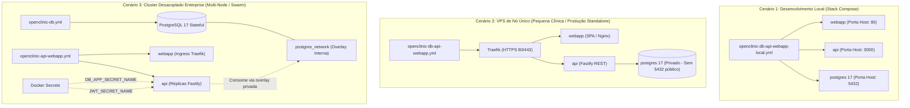
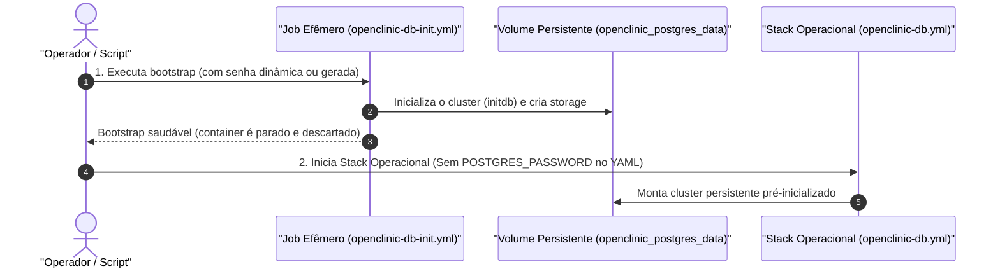

# 🐳 OpenClinic — Catálogo de Stacks Docker & Gerenciamento de Segredos

Este diretório contém as especificações oficiais das stacks Docker do **OpenClinic**, estruturadas de acordo com a separação de responsabilidades (Stateless vs. Stateful) e preparadas para desenvolvimento local (**Docker Compose**) e clustering em produção (**Docker Swarm / Portainer**).

---

## 📑 Índice

1. [Visão Geral e Matriz de Decisão](#-visão-geral-e-matriz-de-decisão)
2. [As Quatro Stacks de Produção e Desenvolvimento](#-as-quatro-stacks-de-produção-e-desenvolvimento)
   - [1. openclinic-db-api-webapp-local.yml (Stack de Desenvolvimento Local)](#1-openclinic-db-api-webapp-localyml-stack-de-desenvolvimento-local--compose)
   - [2. openclinic-db-api-webapp.yml (Produção Standalone / VPS de Nó Único)](#2-openclinic-db-api-webappyml-produção-standalone--vps-de-nó-único)
   - [3. Ciclo de Vida do Banco em Duas Fases: openclinic-db-init.yml vs openclinic-db.yml](#3-ciclo-de-vida-do-banco-em-duas-fases-openclinic-db-inityml-vs-openclinic-dbyml)
   - [4. openclinic-api-webapp.yml (Aplicação Desacoplada Enterprise)](#4-openclinic-api-webappyml-aplicação-desacoplada-enterprise)
3. [Estratégia de Portas de Rede e Segurança](#-estratégia-de-portas-de-rede-e-segurança)
4. [Pré-requisitos de Produção na VPS: Traefik e Redes Compartilhadas](#-pré-requisitos-de-produção-na-vps-traefik-e-redes-compartilhadas)
5. [Arquitetura Secrets-First & Conformidade em Saúde (LGPD / HIPAA)](#-arquitetura-secrets-first--conformidade-em-saúde-lgpd--hipaa)
6. [Convenção Canônica de Nomenclatura de Segredos](#-convenção-canônica-de-nomenclatura-de-segredos)
7. [Guia de Criação de Segredos no Docker Swarm / Portainer](#-guia-de-criação-de-segredos-no-docker-swarm--portainer)
8. [Assistente Interativo de Setup do Desenvolvedor](#-assistente-interativo-de-setup-do-desenvolvedor)

---

## 🏛 Visão Geral e Matriz de Decisão

Para combinar a melhor Experiência do Desenvolvedor (**DX**) com a resiliência exigida em **Produção** (desde servidores VPS de clínicas pequenas até clusters corporativos multi-node), o OpenClinic disponibiliza uma taxonomia estruturada de stacks:



| Cenário de Uso | Stack Recomendada | Principais Características |
| :--- | :--- | :--- |
| **Desenvolvimento Local / Onboarding de Contribuidores** | `openclinic-db-api-webapp-local.yml` | Constrói a partir do código-fonte local. Portas 80, 3000 e 5432 expostas no host. Sem necessidade de Traefik. |
| **Clínica Pequena / Média (VPS de Nó Único)** | `openclinic-db-api-webapp.yml` | Stack de produção completa pronta para uso. Baixa imagens do registry. HTTPS com Traefik. Porta 5432 privada. |
| **Servidor de Banco Dedicado (Enterprise)** | `openclinic-db.yml` | PostgreSQL 17 isolado e persistente com volume dedicado. Porta 5432 privada. Zero senhas de superusuário no YAML. |
| **Aplicação Desacoplada Stateless (Enterprise)** | `openclinic-api-webapp.yml` | Fastify API e React WebApp escaláveis com réplicas. Consome Docker Secrets e HTTPS via Traefik. |
| **Bootstrap Efêmero do Banco (Primeira Execução)** | `openclinic-db-init.yml` | Container descartável de inicialização única que roda `initdb`, cria o cluster e termina. |

---

## 📦 As Quatro Stacks de Produção e Desenvolvimento

### 1. `openclinic-db-api-webapp-local.yml` (Stack de Desenvolvimento Local — Compose)

- **Alvo:** Estação de trabalho do desenvolvedor ou máquina de contribuidores.
- **Objetivo:** Zero atrito para o desenvolvedor. Executa via `npm run setup` ou diretamente via Docker Compose.
- **Serviços:** `postgres`, `api`, `webapp`.
- **Origem das Imagens:** Constrói localmente a partir do código-fonte (`Dockerfile` e `Dockerfile.webapp`).
- **Rede:** `openclinic_network` (bridge local).
- **Portas Expostas:** `80:80` (WebApp), `3000:3000` (API), `5432:5432` (PostgreSQL para ferramentas como DBeaver/TablePlus).
- **Comando:**

  ```bash
  npm run setup
  # ou diretamente:
  docker compose -f infra/docker/stacks/openclinic-db-api-webapp-local.yml up -d --build
  ```

---

### 2. `openclinic-db-api-webapp.yml` (Produção Standalone — VPS de Nó Único)

- **Alvo:** VPS de nó único (ex.: 2 vCPU, 4GB RAM na Hetzner, Contabo, DigitalOcean, AWS Lightsail).
- **Objetivo:** Deploy completo de baixo custo para clínicas privadas e consultórios médicos.
- **Serviços:** `postgres`, `api`, `webapp`.
- **Origem das Imagens:** Imagens oficiais pré-compiladas baixadas do registry (`openclinic/openclinic-api:latest`).
- **Segurança:**
  - A porta de host 5432 **NÃO é exposta** à internet pública (PostgreSQL conecta-se estritamente pela rede `postgres_network`).
  - Certificados HTTPS automáticos via Let's Encrypt gerenciados pelo Traefik.
  - Consome Docker Secrets do cluster para credenciais da aplicação.
- **Comando:**

  ```bash
  docker stack deploy -c infra/docker/stacks/openclinic-db-api-webapp.yml openclinic
  # ou em Compose standalone:
  docker compose -f infra/docker/stacks/openclinic-db-api-webapp.yml up -d
  ```

---

### 3. Ciclo de Vida do Banco em Duas Fases: `openclinic-db-init.yml` vs `openclinic-db.yml`

Para eliminar permanentemente credenciais de superusuário (`POSTGRES_PASSWORD`) dos YAMLs operacionais e da inspeção persistente de containers, o OpenClinic separa a inicialização do banco de dados da sua operação contínua:



- **Bootstrap Efêmero (`openclinic-db-init.yml`):**
  - Container: `openclinic-db-init` (`restart: "no"`).
  - **Desenvolvimento Local:** Suporta `DB_PASS=` (em branco) e `POSTGRES_HOST_AUTH_METHOD=trust` para setup sem atrito.
  - **Servidor Remoto / VPS / Produção (Exigência Crítica de Segurança):** É estritamente proibido deixar `DB_PASS` em branco ou usar `trust`. É **obrigatório** definir uma senha forte para o superusuário `postgres` (`DB_PASS`) e configurar `POSTGRES_HOST_AUTH_METHOD=scram-sha-256`. Ao utilizar o assistente `npm run setup`, essa senha é gerada automaticamente (`crypto.randomBytes(24)`) ou solicitada interativamente.
  - Assim que a inicialização do volume é concluída, o container é destruído e descartado.
- **Operação Contínua (`openclinic-db.yml`):**
  - Container: `openclinic-db` (`restart: unless-stopped`).
  - **Arquitetura Secrets-First:** Lê a credencial do superusuário diretamente de um Docker Secret (`openclinic-${ENVIRONMENT}-postgres-password`) montado em `/run/secrets/postgres_password` via `POSTGRES_PASSWORD_FILE`. Elimina 100% o uso de `DB_PASS` ou senhas em texto puro nos arquivos `.env`.
  - Monta o volume persistente pré-inicializado `openclinic_postgres_data` e junta-se à rede privada `postgres_network`. A porta de host 5432 fica estritamente fechada/privada para segurança em produção.

> [!WARNING]
> **Invariante de Segurança em Produção / VPS:** Nunca execute `openclinic-db-init` em servidor remoto ou VPS com `POSTGRES_HOST_AUTH_METHOD=trust` ou senha vazia. Configure sempre `scram-sha-256` e atribua uma senha criptográfica forte ao superusuário `postgres` durante a fase de bootstrap.

---

### 4. `openclinic-api-webapp.yml` (Aplicação Desacoplada Enterprise)

- **Alvo:** Cluster multi-node Docker Swarm / Portainer com camada de banco de dados desacoplada.
- **Objetivo:** Deploy contínuo e escalabilidade horizontal independente do backend e frontend sem impactar o armazenamento persistente do banco.
- **Serviços:** `api` (Fastify REST API) e `webapp` (Nginx + React 19).
- **Redes:** `traefik_network` (ingress HTTPS) e `postgres_network` (overlay privada de banco).
- **Segurança:** Nenhuma porta de host é exposta. Todo o tráfego é roteado pelo Traefik sob TLS. Segredos montados com permissão `mode: 0400` pertencentes ao usuário não-root `appuser` (`uid: 1001`).

---

## 🛡 Estratégia de Portas de Rede e Segurança

| Stack e Serviço | Dev Local (`*-local.yml`) | Produção VPS (`openclinic-db-api-webapp.yml`) | Swarm Desacoplado (`openclinic-api-webapp.yml`) | Justificativa Técnica |
| :--- | :---: | :---: | :---: | :--- |
| **`webapp` (Porta 80)** | **EXPOSTA** (`80:80`) | **NÃO EXPOSTA** | **NÃO EXPOSTA** | Em produção, o Traefik recebe o tráfego nas portas 80/443 e roteia internamente via `traefik_network`. Expor a porta 80 diretamente causaria conflito com o Traefik. |
| **`api` (Porta 3000)** | **EXPOSTA** (`3000:3000`) | **NÃO EXPOSTA** | **NÃO EXPOSTA** | Em produção, o Traefik gerencia `/docs` e endpoints da API sob TLS. Expor a porta 3000 criaria um bypass HTTP desprotegido sem SSL. |
| **`postgres` (Porta 5432)** | **EXPOSTA** (`5432:5432`) | **NUNCA EXPOSTA** | **NUNCA EXPOSTA** | A API conecta-se estritamente pela overlay privada `postgres_network`. Expor 5432 em VPS pública expõe o banco a ataques de força bruta e varreduras de porta. |

---

## 🌐 Pré-requisitos de Produção na VPS: Traefik e Redes Compartilhadas

Antes de fazer o deploy das stacks de produção no Docker Swarm ou Portainer da sua VPS, crie as redes overlay compartilhadas:

### 1. Criar Redes Overlay Compartilhadas

Execute no nó Swarm Manager:

```bash
# Rede de borda pública do Traefik (compartilhada com aplicações web)
docker network create --driver overlay --attachable traefik_network

# Rede privada de banco de dados (isolada para banco e serviços backend)
docker network create --driver overlay --attachable postgres_network
```

### 2. Requisito do Reverse Proxy Traefik

O OpenClinic utiliza labels do Traefik para obtenção automática de certificados SSL/TLS via Let's Encrypt (`myresolver`), redirecionamento automático HTTP → HTTPS e suporte a WebSocket/HTTP/2.

Certifique-se de que a VPS possui o Traefik em execução na `traefik_network` vinculando as portas de host `80` e `443`. Exemplo de serviço Traefik Swarm:

```bash
docker service create \
  --name traefik \
  --constraint 'node.role == manager' \
  --publish mode=host,target=80,published=80 \
  --publish mode=host,target=443,published=443 \
  --mount type=bind,source=/var/run/docker.sock,target=/var/run/docker.sock \
  --mount type=volume,source=traefik_certificates,target=/certificates \
  --network traefik_network \
  traefik:v3.1 \
  --providers.docker=true \
  --providers.docker.swarmmode=true \
  --providers.docker.exposedbydefault=false \
  --entrypoints.web.address=:80 \
  --entrypoints.websecure.address=:443 \
  --certificatesresolvers.myresolver.acme.email=admin@example.com \
  --certificatesresolvers.myresolver.acme.storage=/certificates/acme.json \
  --certificatesresolvers.myresolver.acme.httpchallenge.entrypoint=web
```

---

## 🔐 Arquitetura Secrets-First & Conformidade em Saúde (LGPD / HIPAA)

Como um sistema de gestão médica que manipula prontuários eletrônicos e Dados Pessoais Sensíveis de Saúde (*Protected Health Information - PHI*), o OpenClinic cumpre rigorosamente as normas estabelecidas pela **LGPD (Lei Geral de Proteção de Dados - Lei 13.709/2018, Art. 46)** e pela norma internacional **HIPAA Security Rule (§ 164.312)**.

### O que é a Arquitetura Secrets-First?

No OpenClinic, o princípio **Secrets-First** estabelece que dados confidenciais (senhas de banco de dados, chaves criptográficas, certificados e credenciais de acesso) **são cidadãos de primeira classe na segurança**:

> **Invariante Secrets-First:** Nenhuma credencial sensível deve trafegar ou existir em texto puro dentro de arquivos `.env`, declarações `environment:` de compose/stack, parâmetros de linha de comando ou saídas de `docker inspect`. Todos os dados sensíveis são injetados pelo orquestrador como segredos criptográficos diretamente em memória (`tmpfs` em `/run/secrets/`).

### Os 3 Pilares do Secrets-First no OpenClinic

1. **Camada do Motor PostgreSQL (`openclinic-db.yml` e `openclinic-db-api-webapp.yml`):**
   - Utiliza a variável canônica do PostgreSQL oficial `POSTGRES_PASSWORD_FILE: /run/secrets/postgres_password`.
   - A senha do superusuário do banco é lida em tempo de execução a partir do segredo `openclinic-${ENVIRONMENT}-postgres-password`.
   - **Zero senhas no `.env` do banco:** os arquivos de variáveis contêm apenas metadados públicos (`DB_NAME=openclinic`, `DB_USER=postgres`, `DB_PORT=5432`).
2. **Camada da Aplicação REST API (`openclinic-api-webapp.yml` e `openclinic-db-api-webapp.yml`):**
   - O backend Fastify carrega a tupla completa de conexão (`host`, `port`, `database`, `user`, `password`) a partir do segredo estruturado JSON montado em `/run/secrets/database-secret-app`.
   - **Zero credenciais de conexão no `.env` da API:** o `.env` declara apenas o identificador do segredo (`DB_APP_SECRET_NAME`) e configurações não-sensíveis (`LOG_LEVEL`, `APP_PORT`).
3. **Camada Criptográfica (Tokens JWT):**
   - A chave de assinatura simétrica dos tokens de autenticação é carregada a partir do segredo montado em `/run/secrets/jwt-secret` (`JWT_SECRET_NAME`).

### Resolução Transparente por Ambiente (`SECRETS_PROVIDER`)

- **`SECRETS_PROVIDER=file` (Padrão Canônico):**
  - **Desenvolvimento Local:** Gerenciado de forma transparente pelo assistente `npm run setup`, que inicializa os arquivos locais em `./secrets/` (ignorados pelo Git). O Compose local monta `./secrets` como somente leitura (`:ro`). Desenvolvedores têm zero atrito no setup.
  - **Docker Swarm / Portainer em Produção:** Injetados diretamente em memória (`tmpfs`) em `/run/secrets/<nome_do_segredo>` com permissões restritas `mode: 0400` pertencentes ao usuário não-root `appuser (1001:1001)`.
- **Provedores Cloud:**
  - **`SECRETS_PROVIDER=gsm`:** Google Secret Manager (GCP).
  - **`SECRETS_PROVIDER=aws`:** AWS Secrets Manager.

---

## 🔐 Convenção Canônica de Nomenclatura de Segredos

Os nomes de segredos seguem estritamente o formato **kebab-case** e segmentação semântica:

- **`-credentials` (Payload JSON Estruturado):** Utilizado para credenciais de conexão do banco (`host`, `port`, `database`, `user`, `password`).
- **`-secret` (Chave Criptográfica Atômica):** Utilizado para chaves simétricas (como a chave de assinatura de tokens JWT).
- **`-password` (Texto Puro Atômico):** Utilizado para a senha de superusuário do container PostgreSQL (`POSTGRES_PASSWORD_FILE`).

### Matriz Canônica de Segredos por Ambiente

| Escopo / Ambiente | Nome do Secret no Swarm / Portainer | Tipo | Ponto de Montagem no Container | Consumidor Principal |
| :--- | :--- | :--- | :--- | :--- |
| **Desenvolvimento (App DML)** | `openclinic-dev-app-postgres-credentials` | JSON | `/run/secrets/database-secret-app` | `api` (Fastify REST) |
| **Desenvolvimento (Owner DDL)** | `openclinic-dev-owner-postgres-credentials` | JSON | `/run/secrets/database-secret-owner` | Migrações / CLI |
| **Desenvolvimento (PostgreSQL Superuser)** | `openclinic-dev-postgres-password` | String | `/run/secrets/postgres_password` | `postgres` (Engine DB) |
| **Desenvolvimento (Chave JWT)** | `openclinic-dev-jwt-secret` | String | `/run/secrets/jwt-secret` | `api` (Fastify REST) |
| **Staging (App DML)** | `openclinic-stage-app-postgres-credentials` | JSON | `/run/secrets/database-secret-app` | `api` (Fastify REST) |
| **Staging (Owner DDL)** | `openclinic-stage-owner-postgres-credentials` | JSON | `/run/secrets/database-secret-owner` | Migrações / CLI |
| **Staging (PostgreSQL Superuser)** | `openclinic-stage-postgres-password` | String | `/run/secrets/postgres_password` | `postgres` (Engine DB) |
| **Staging (Chave JWT)** | `openclinic-stage-jwt-secret` | String | `/run/secrets/jwt-secret` | `api` (Fastify REST) |
| **Produção (App DML)** | `openclinic-prod-app-postgres-credentials` | JSON | `/run/secrets/database-secret-app` | `api` (Fastify REST) |
| **Produção (Owner DDL)** | `openclinic-prod-owner-postgres-credentials` | JSON | `/run/secrets/database-secret-owner` | Migrações / CLI |
| **Produção (PostgreSQL Superuser)** | `openclinic-prod-postgres-password` | String | `/run/secrets/postgres_password` | `postgres` (Engine DB) |
| **Produção (Chave JWT)** | `openclinic-prod-jwt-secret` | String | `/run/secrets/jwt-secret` | `api` (Fastify REST) |

---

## 🛠 Guia de Criação de Segredos no Docker Swarm / Portainer

Execute os comandos abaixo no nó Manager da sua VPS para registrar os 4 segredos canônicos antes de iniciar as stacks:

```bash
# 1. Credenciais da Aplicação (Fastify REST API - Usuário DML Restrito)
printf '{"host":"postgres","port":5432,"database":"openclinic","user":"openclinic_app","password":"SUA_SENHA_FORTE_DO_APP"}' | docker secret create openclinic-prod-app-postgres-credentials -

# 2. Credenciais do Proprietário (Migrações / DDL via CLI)
printf '{"host":"postgres","port":5432,"database":"openclinic","user":"openclinic_owner","password":"SUA_SENHA_FORTE_DO_OWNER"}' | docker secret create openclinic-prod-owner-postgres-credentials -

# 3. Senha de Superusuário PostgreSQL (Container do Banco - Stacks openclinic-db e openclinic-db-api-webapp)
printf 'SUA_SENHA_FORTE_DO_POSTGRES' | docker secret create openclinic-prod-postgres-password -

# 4. Chave de Assinatura JWT (Chave criptográfica com no mínimo 32 caracteres)
printf '{"secretKey":"SUA_CHAVE_SECRETA_ALEATORIA_MINIMO_32_CHARS"}' | docker secret create openclinic-prod-jwt-secret -
```

*(Para ambientes de homologação ou desenvolvimento, substitua `-prod-` por `-stage-` ou `-dev-`).*

*(Para ambientes de homologação ou desenvolvimento, substitua `-prod-` por `-stage-` ou `-dev-`).*

---

## 🚀 Assistente Interativo de Setup do Desenvolvedor

```bash
# Executor multiplataforma via npm
npm run setup

# Ou scripts diretos:
.\setup.ps1          # Windows (PowerShell)
./setup.sh           # Linux / macOS (Bash)
```
